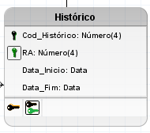

## Normalização — Primeira Forma Normal (1FN)

Com o modelo lógico definido, a etapa seguinte foi revisar cada entidade
à luz da Primeira Forma Normal, que exige que todo atributo seja atômico
(indivisível) e que não existam grupos repetitivos ou atributos
multivalorados.

## Tabela Aluno

Filiação agrupava duas informações distintas — o nome do pai e o
nome da mãe — em um único campo. Foi decomposto em Nome_Pai e
Nome_Mãe.
Contato era um atributo multivalorado, admitindo diferentes formas
de contato (e-mail, telefone, WhatsApp) em um mesmo campo. Foi
decomposto em Email e Whatsapp; o telefone não precisou de novo
campo aqui, pois já existia um atributo próprio para isso.
Telefone também era multivalorado, já que um aluno pode ter mais de
um número. A decomposição adotada — em Telefone_Res e
Telefone_Cel — reflete a regra de negócio deste projeto; em outros
contextos, o número de campos necessários pode variar. Nesta etapa, os
novos campos permaneceram na própria tabela Aluno; se devem ou não migrar
para uma tabela à parte é uma decisão resolvida nas formas normais
seguintes.

## Tabela Histórico

Período_Realização representava dois valores implícitos — data de
início e data de término — em um único campo. Foi substituído pelos
campos Data_Início e Data_Fim

## Demais tabelas

Departamento, Professor, Curso, Disciplina e Turma já possuíam apenas
atributos atômicos desde o modelo lógico, atendendo a 1FN sem
necessidade de ajustes.
