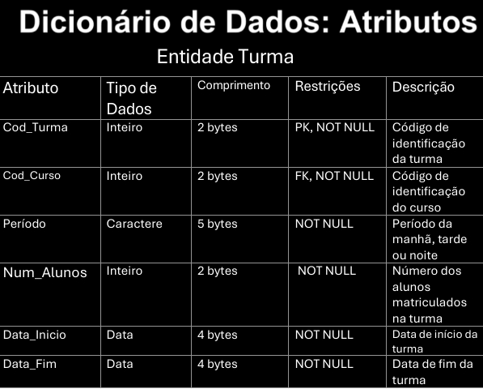

## Dicionário de Dados

# Entidades e Relacionamentos

As tabelas abaixo documentam, para cada entidade, os relacionamentos que
ela mantém com outras entidades do modelo, os nomes de cada
relacionamento e uma breve descrição de cada entidade.

## Atributos

A seguir, os atributos de cada entidade: nome, tipo de dado, comprimento,
restrições (chave primária, chave estrangeira, obrigatoriedade) e uma
breve descrição de cada campo.

